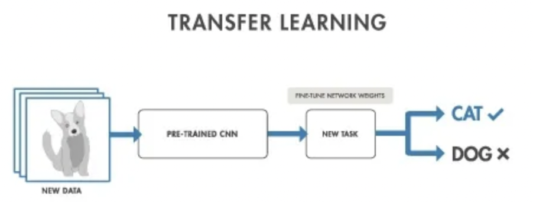
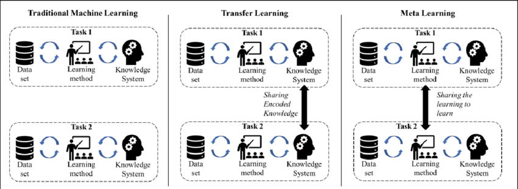
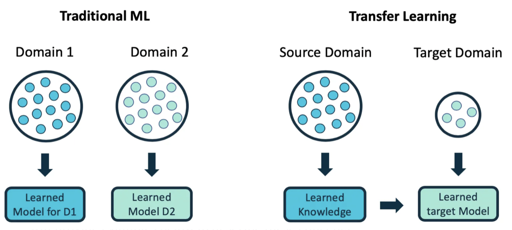
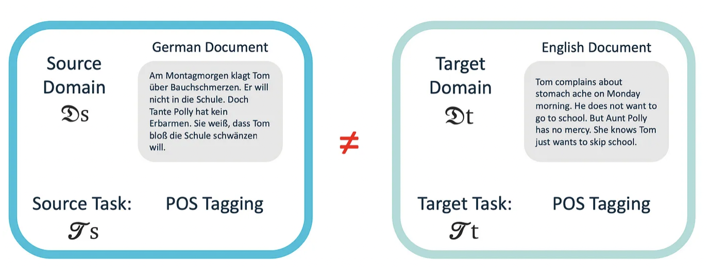
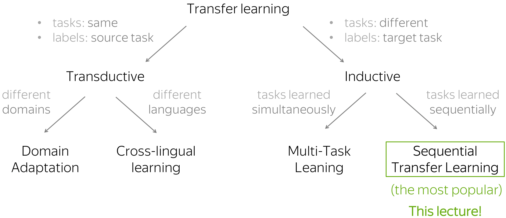

# 전이학습 기초

<!-- TOC -->

# 1. 전통적인 학습 방식 vs 전이학습 비교

- 전통적인 학습 방식: 특정 과제만 국한해 해결한도록 설계
- 전이학습: 관련된 다른 과제에 사전 학습된 모델 재사용 
 여러 과제를 넘나들면서 병렬적으로 학습하는 게 아니라 단계적으로 학습 
 -> 지식통합, 귀납적 
    - ex. 두 개 클래스 분류 모델을 기반으로 전이학습을 통해 세 개 모델 분류 모델로 확장
    
- 참고. 전이학습과 메타학습의 차이
    
    - 전이학습: 학습 알고리즘을 한 모델에서 다른 모델로 '전달'하는 능력. 기존학습된 모델(pretrained model)의 피쳐 layer에 새로 학습할 layer를 연결
      ex. 아이가 부모님의 경험을 통해 배움
    - 메타학습: *"Learning to Learn"*(학습을 위한 학습) 
      ex. 1+1=2를 배울 때 이 사례 뿐 아니라 덧셈에 대한 기본원리를 배우는 것

# 2. 전이학습 장점

- 모델은 대개 학습 데이터에 편향돼 잘맞춤, 학습되지 않은 데이터에는 잘 작동하지 않음(일반화X), 전이학습은 새로운 과제에 적용하도록 함
    - 기본성능향상: 모델이 가진 지식 범위가 늘어남
    - 모델 개발 시간 단축: 처음부터 학습하지 않으므로 학습 시간 단축에 도움
    - 성능 향상

# 3. 참고. 용어정리

1. **도메인(Domain):**
   - **개념:** 도메인은 데이터의 분포와 특성이 일반적으로 유사한 환경 또는 공간을 의미. 도메인은 특정 작업이나 환경에서 발생한 데이터의 특징을 나타내며, 이는 입력 공간과 출력 공간의 조합으로 이루어짐
   - **예시:** 이미지 분류 작업에서 도메인은 특정 종류의 이미지를 나타낼 수 있으며, 언어 모델에서는 특정 언어의 텍스트 데이터가 해당 언어의 도메인에 속함

2. **소스(Source):**
   - **개념:** 소스 도메인은 전이학습에서 학습된 초기 모델이나 데이터의 출처를 나타냄. 소스 도메인에서는 이미 학습된 모델이나 데이터를 가져와 새로운 작업이나 도메인에 적용.
   - **예시:** 이미지 분류 작업에서 소스 도메인은 모델이 초기에 학습한 데이터셋이며, 언어 모델에서 소스 도메인은 모델이 초기에 학습한 언어의 텍스트 데이터가 됨.

3. **타겟(Target):**
   - **개념:** 타겟 도메인은 전이학습의 목적으로 모델이 적용되고자 하는 새로운 작업이나 환경을 나타냄. 전이학습은 주로 소스 도메인에서 학습한 지식을 활용하여 타겟 도메인에서 성능을 향상시키는 것을 목표로 함.
   - **예시:** 이미지 분류 작업에서 타겟 도메인은 모델이 새로운 데이터셋에서 성능을 향상시키려는 대상이며, 언어 모델에서 타겟 도메인은 새로운 언어의 텍스트 데이터가 됨.

- 전이학습에서는 소스 도메인에서 학습한 지식을 타겟 도메인으로 효과적으로 전이하여 일반화 성능을 향상하고자 함.

# 4. 전이학습 전략
- 전이 고려사항  
    새로 해결해야하는 과제를 타겟 과제라고 부를 때,
    - 전이 항목: 기존 지식의 어떤 부분을 타겟과제로 전이할 것인가? -> 기존 지식과 타겟 과제의 공통점 파악
    - 전이 시기: 전이해야하는 상황과 하지 말아야하는 상황 정의,전이학습으로 인한 악영향 방지(오히려 성능이 하락되는 상황)
    - 전이 방법: 어떤 상황에서 무슨 답변을 했는지를 통해 전이학습이 어떤 방식으로 진행됐는지 파악 가능

# 5. 전이학습 유형

## 5.1. 알고리즘 유형에 따른 전이학습 유형

1. **귀납적 전이 (Inductive Transfer)**
    - **개념**: 귀납적 전이는 학습된 모델을 새로운 작업에 적용하는 것. 즉, 이전에 학습한 지식을 새로운 작업에 적용하여 성능을 향상시키는 것입니다.
    - **예시**: 이미지 분류에서 강아지를 인식하는 모델을 학습한 후, 이 모델을 다른 이미지 분류 작업에 사용하여 특정 물체를 인식하는 데 활용할 수 있습니다.
2. **비지도 전이 (Unsupervised Transfer)**
    - **개념**: 비지도 전이는 원래 작업에는 레이블이 없는 데이터를 사용하여 학습된 모델을, 다른 작업에 적용하는 것. 즉, 레이블이 없는 데이터에서 학습된 특성을 활용하여 다른 작업에 적용합니다.
    - **예시**: 오토인코더(unsupervised learning의 한 형태)를 사용하여 얼굴 이미지를 학습한 후, 얼굴 감지나 특징 추출과 같은 작업에 이 모델을 적용할 수 있습니다.
4. **변환 전이 (Transformation Transfer)**
    - **개념**: 변환 전이는 입력 데이터를 새로운 표현 형식으로 변환하여 다른 작업에 사용하는 것. 이러한 변환은 일반적으로 입력 데이터의 특성을 강조하거나 노이즈를 줄이는 등의 목적을 가지고 있습니다.
    - **예시**: 입력 데이터를 특정 도메인에서 다른 도메인으로 변환하는 도메인 적대적 학습(GANs)을 사용하여 특정 작업에 적합한 데이터로 변환한 후, 변환된 데이터를 사용하여 작업을 수행할 수 있습니다.

- 전이학습은 보통 위에 설명한 귀납적 전이, 비지도 전이, 변환 전이로 분류되지만 딥러닝의 발전 덕에 세 가지 영역의 경계가 유연한 새 분류 체계가 등장했다. 레이블이 있는지 없는지 상관없이 기존 과제와 새 과제 간 도메인의 유사성에 따라 *Homogeneous transfer learning*과 *heterogeneous transfer learning*로 분류하는 추세다.

## 5.2. 전이 대상에 따른 전이학습 유형
전이 학습은 다양한 측면에서 이루어질 수 있으며, 인스턴스 전이, 특성 표현 전이, 파라미터 전이, 관계형 지식 전이는 전이 학습의 다양한 방법을 나타냄.

1. **인스턴스 전이 (Instance Transfer)**
   - **개념:** 인스턴스 전이는 이전 작업에서 학습된 인스턴스(데이터 포인트)를 새로운 작업에 직접 적용하는 것. 이는 샘플 수준에서의 전이로 볼 수 있습니다.
        - 추가 설명: 보통 기존 학습 모델에 사용된 데이터를 재사용할 수 없음. 기존 학습 모델에 사용된 데이터 중 일부를 재사용해 새 과제 성능 향상에 도움을 줌
   - **예시:** 이전에 학습한 이미지 분류 작업에서 일부 이미지 샘플을 가져와, 이를 새로운 작업에 사용하여 성능을 향상시킴

2. **특성 표현 전이 (Feature Representation Transfer)**
   - **개념:** 특성 표현 전이는 이전 작업에서 학습된 모델의 특성 표현을 새로운 작업에 적용하는 것. 모델의 중간층의 활성화 값을 가져와 새로운 작업에 사용 가능
        - 추가 설명: 기존 과제에서의 데이터와 새 과제에서의 데이터 공통으로 활용 가능한 좋은 표현 특성을 알아내 활용, 지도 & 비지도 과제 모두 적용 가능
   - **예시:** 이미지 분류 작업에서 학습한 신경망의 중간층의 특성 맵을 추출하여, 이를 새로운 작업에서 사용하여 이미지 특징을 전이

3. **파라미터 전이 (Parameter Transfer):**
   - **개념:** 파라미터 전이는 이전 작업에서 학습된 모델의 가중치 파라미터를 새로운 작업에 전이하는 것. 이는 모델 수준에서의 전이.
        - 추가 설명: 기존 과제와 새 과제가 사전 분포(하이퍼파라미터 or 파라미터)를 공유한다고 가정
   - **예시:** 이전에 언어 모델을 학습한 후, 이를 새로운 자연어 처리 작업에 적용하여 성능을 향상시킴

4. **관계형 지식 전이 (Relational Knowledge Transfer)**
   - **개념:** 관계형 지식 전이는 두 작업 간의 관계나 상호 작용에 대한 지식을 전이하는 것 -> 작업 간의 관계를 모델에 전달하는 방식
        - 추가 설명: IID(Independent and identically distributed)가 아닌(데이터 포인트끼리 독립적X, 동일 분포X) 데이터를 처리, ex. 소셜 네트워크 데이터
   - **예시:** 어떤 도메인에서 학습된 지식을 가져와, 이 지식을 새로운 도메인의 작업에 적용하여 성능을 향상시킴

# 6. 딥러닝에서의 전이 학습 

## 6.1. 전이학습 방법

1. 특성 추출: 사전학습된 딥러닝 모델의 중간까지의 층을 발췌해 최종 층은 새로 연결
2. 미세 튜닝: 1에서와 같이 최종 층을 대체 & 발췌된 기존 층 일부를 선택적으로 재훈련
3. 사전 훈련 모델

## 6.2. 심층 전이학습 유형

1. **도메인 적응 (Domain Adaptation):**
   - **개념:** 한 도메인에서 학습한 모델을 다른 관련 도메인으로 전이하는 것. 주로 도메인 간 분포의 차이로 인해 발생하는 문제를 해결하기 위한 기술. 도메인 간의 특성 차이를 줄이는 방식으로 모델을 학습시키는 것이 목표.
   - **예시:** 얼굴 인식 모델을 실내에서 촬영한 이미지로 학습한 후, 이를 실외에서 얼굴을 인식하는 데 적용

2. **도메인 혼란 (Domain Confusion):**
   - **개념:** 특성을 혼란시키는 방식으로 모델을 학습시키는 전이 학습 기술. 도메인 간의 특성을 구별하는 대신, 모델은 각 도메인에서의 특성을 혼란시켜서 일반화를 촉진하도록 학습.
   - **예시:** 도메인 간의 특성을 혼란시키기 위해 도메인 분류기를 학습하고, 도메인 간의 특성을 혼란시키는 손실을 최소화하는 방식으로 모델을 학습.

3. **다중 과제 학습 (Multi-Task Learning):**
   - **개념:** 다중 과제 학습은 모델이 여러 작업을 동시에 학습하는 방식으로, 각 작업 간에 지식을 전이하여 일반화 성능을 향상시키는 것을 목표로 함.
   - **예시:** 언어 모델이 문장 분류와 개체명 인식을 동시에 학습하여, 두 작업 간의 공통된 특성을 학습하고 이를 전이하여 성능을 향상시킴

4. **원샷 학습 (One-Shot Learning):**
   - **개념:** 단 하나의 예제만을 사용하여 새로운 작업에 대해 학습. 모델은 매우 적은 양의 데이터로부터 학습하고, 새로운 작업에 대해 일반화할 수 있도록 설계됨.
   - **예시:** 얼굴 인식에서 한 사람에 대한 하나의 이미지만 사용하여 해당 사람을 식별하는 모델을 학습

5. **제로샷 학습 (Zero-Shot Learning):**
   - **개념:** 제로샷 학습은 어떠한 학습 예제도 제공되지 않은 클래스에 대해 모델이 학습하고 이를 분류. 모델은 주어진 클래스에 대한 몇 가지 지식을 이용하여 새로운 클래스에 대한 예측을 수행.
   - **예시:** 자연어 처리에서 모델이 특정 단어에 대한 언어적 속성을 학습하고, 이를 이용하여 새로운 단어에 대한 분류를 수행.

# 6. 전이 학습에서의 해결 과제

1. 부정적 전이
2. 전이 범위

# 7. 실습코드 예제
- 전이학습 모델 = (1) base model(사전학습된 모델 구조에서 일정 부분 slice) + (2) task에 맞는 new layer 추가(분류기 등 추가)
- 전이학습 모델에 task에 맞는 데이터를 추가 학습하면 base model에서 사전에 추정된 파라미터는 고정된 채로 new layer의 파라미터만 새로 추정됨
- 코드로 보면 "trainable = False"를 설정하는데, 이는 사전학습된 베이스 모델 부분의 레이어 내 파라미터는 더이상 학습하지 않고 고정하라는 의미, 새로 추가된 레이어에 한해 소량의 데이터로 추정하면 됨
   ~~~python
   # 사전학습된 베이스 모델
   base_inception = InceptionV3(weights='imagenet', 
                              include_top = False,  # 마지막 층 바로 전까지만 가져오기
                              input_shape=(299, 299, 3))

   ###
   # 분류기 등 new layer 연결
   # ...
   ###

   model = Model(inputs=base_inception.input, outputs=predictions)

   # !중요! 사전학습된 베이스 모델은 파라미터 고정
   for layer in base_inception.layers:
      layer.trainable = False
      
   # Compile 
   model.compile(Adam(lr=.0001), loss='categorical_crossentropy', metrics=['accuracy']) 
   ~~~

-----
## 참고 자료
- 디파니안 사르카르 et al., 파이썬을 활용한 딥러닝 전이학습, 2019 
- [위키독스](https://wikidocs.net/178446)
   - [코드 다운로드](https://wikibook.co.kr/transfer-learning/)
- [An Introduction to Transfer Learning](https://medium.com/georgian-impact-blog/transfer-learning-part-1-ed0c174ad6e7)
- chatGPT(4, 5.1, 5.2, 6.1, 6.2)
